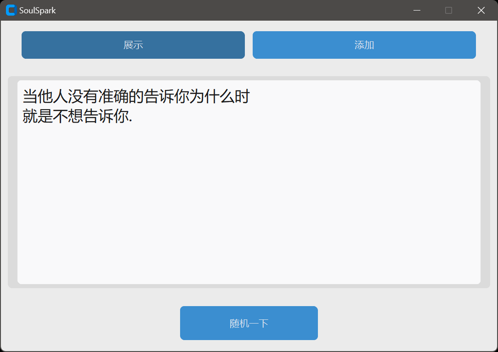

# SoulSpark

## 项目概述

这是一款基于 Python 开发的励志话语提醒工具，能够在电脑上以窗口显示和桌面通知的形式，定时向用户推送随机的励志话语，帮助用户在工作和学习中保持积极的心态。用户还可以自行添加新的励志话语，丰富语录库。

## 项目展示

- **软件主体UI**


- **通知任务栏显示**


## 功能特点

1. **定时提醒**：按照设定的时间间隔（默认 5 分钟），随机从语录库中选取励志话语进行提醒。

1. **多形式展示**：既可以在软件窗口中完整显示励志话语，也能以桌面通知的形式推送，通知会根据内容长度自动分页。

1. **语录管理**：支持用户添加新的励志话语，且添加的内容会自动保存到本地文件中。

1. **窗口灵活调整**：软件窗口大小可自由调整，文字会根据窗口宽度自动换行，同时设有最小尺寸限制，保证良好的显示效果。

1. **系统托盘支持**：程序运行时会在系统托盘显示图标，方便用户快速切换窗口状态或退出程序。

1. **菜单操作**：提供菜单栏，包含文件、功能、帮助等选项，便于用户进行各种操作和了解软件信息。

## 安装说明

1. **环境要求**：需要安装 Python 3.x 环境。

1. **安装依赖库**：打开命令行窗口，执行以下命令安装所需的依赖库：

``` powershell
uv pip sync
```

1. **获取程序文件**：将项目中的 Python 代码文件（.py）、默认语录存储文件（Bible.txt）和托盘图标文件（icon.ico）放在同一目录下。

## 使用方法

1. **运行程序**：在命令行中进入程序所在目录，执行 Python 代码文件，如：

``` powershell
make run
```

1. **查看励志话语**：程序运行后会自动显示一个窗口，窗口中会展示随机的励志话语，同时会按照设定的时间间隔在桌面推送通知。点击窗口底部的 “随机话语” 按钮，可立即切换显示一条随机的励志话语。

1. **添加新话语**：通过菜单栏的 “功能”->“添加话语”，在弹出的输入窗口中输入新的励志话语，点击 “保存” 即可将其添加到语录库中。

1. **窗口操作**：可直接拖动窗口边缘调整大小；点击窗口关闭按钮，窗口会隐藏到系统托盘；通过系统托盘图标可切换窗口的显示与隐藏状态。

1. **退出程序**：可以通过菜单栏的 “文件”->“退出”，或者系统托盘图标的 “退出” 选项，关闭程序。

## 配置参数说明

在代码的 “配置参数” 部分，可以根据个人需求进行以下参数的修改：

- TIME_RANDOM：设置励志话语更新的时间间隔，单位为毫秒，默认值为 300000（即 5 分钟）。

- WORD_LENGTH：限制添加的语录的最大字符长度，默认值为 100。

- QUOTE_FILE：指定语录存储文件的路径，默认值为 “Bible.txt”。

- ICON_FILE：指定托盘图标文件的路径，默认值为 “icon.ico”。

- WINDOW_WIDTH和WINDOW_HEIGHT：设置窗口初始的宽度和高度，默认值分别为 1100 和 500。

- MIN_WINDOW_WIDTH和MIN_WINDOW_HEIGHT：设置窗口的最小宽度和高度，默认值分别为 800 和 500。

## 常见问题

1. **托盘图标加载失败**：检查图标文件（icon.ico）是否存在于指定路径下，若文件损坏或路径错误，会导致图标加载失败，程序可能会退出。

1. **通知无法显示**：确保电脑的通知功能正常开启，且win11toast库安装正确。

1. **添加语录失败**：若输入的语录为空或超过设定的最大字符长度，会收到相应的警告提示，需按照要求重新输入。

## 注意事项

1. 语录存储文件（默认 Bible.txt）和托盘图标文件（默认 icon.ico）需与 Python 代码文件放在同一目录下，若要更换路径，需修改相应的配置参数。

1. 在添加励志话语时，尽量避免输入过长的内容，以免影响显示效果。

1. 调整时间间隔时，过短的间隔可能会频繁推送通知，影响用户正常工作和学习，建议根据实际情况合理设置。
